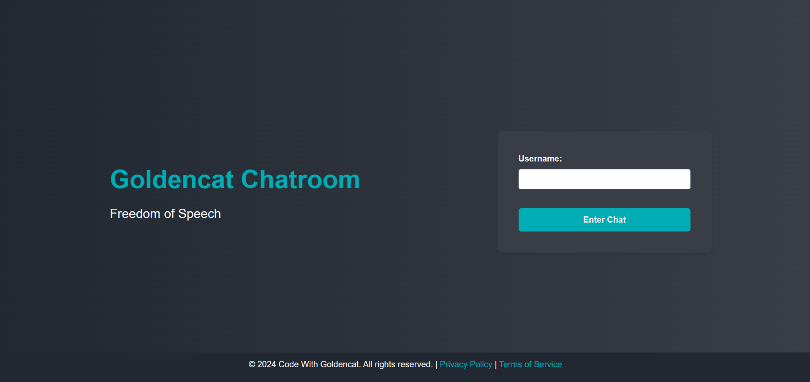
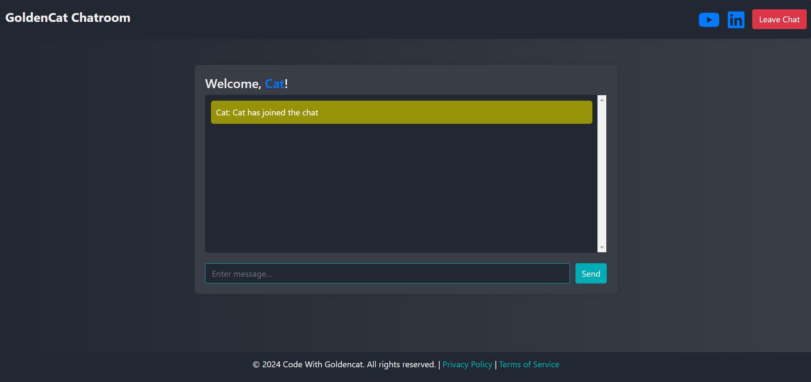
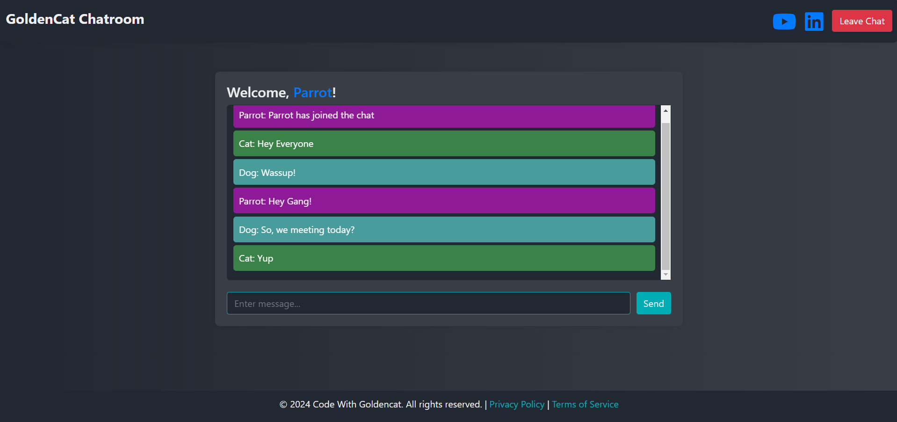

# Chatroom

A real-time chatroom web application built using Java 17, Spring Boot, WebSocket, and Thymeleaf. This application allows users to chat in a shared environment, featuring a modern tech stack with a responsive user interface.

## Features

- **Real-Time Messaging**: Users can send and receive messages instantly, powered by WebSocket technology.
- **User Login**: Simple username-based login to access the chatroom.
- **User Notifications**: Announcements are made when a user joins or leaves the chatroom.
- **Custom User Colors**: Unique, soothing colors are assigned to each user's messages for easy identification.
- **Responsive Design**: Built with Bootstrap to ensure a consistent experience across devices.
- **Social Media Integration**: Links to social profiles are provided in the chatroom header.

## Tech Stack

- **Backend**: Java 17, Spring Boot
- **Frontend**: Thymeleaf, Bootstrap, Font Awesome
- **Real-Time Communication**: Spring WebSocket, STOMP protocol
- **Build Tool**: Maven

## Setup Instructions

### Prerequisites
- Java 17 or higher
- Maven 3.6+

### Steps to Run Locally

1. **Clone the Repository**:
   ```sh
   git clone https://github.com/manjuappu1375/chat_room.git
   cd ChatRoom
   ```

2. **Build the Project**:
   ```sh
   mvn clean install
   ```

3. **Run the Application**:
   ```sh
   java -jar chatroom-0.0.1-SNAPSHOT.jar
   ```

4. **Access the Application**:
   Open your browser and navigate to `http://localhost:8080`.

## Usage

- **Login**: Enter your desired username to join the chatroom.
- **Chat**: Send messages to other users in real-time. You will be notified when new users join or leave the chat.

## Contributions

Contributions are welcome! Feel free to open an issue or submit a pull request to improve the project.

## Screenshots





## Future Enhancements

- **Private Messaging**: Allow users to send direct messages to one another.
- **Authentication**: Implement user authentication for a more secure experience.
- **Media Sharing**: Add support for sharing images and files within the chat.

